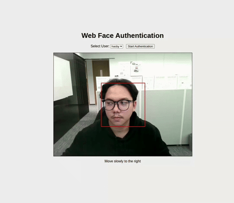

# Face Liveness Test

This project is a facial biometric authentication system with a "liveness" check. It verifies a user's identity by matching their face against a registered image and ensures the user is a live person by asking them to perform a series of head movements.


<h2 align="center">
  <br/>
</h2>


## How It Works

1.  **User Registration**: Users are "registered" by placing an image file (e.g., `john_doe.jpg`) in the `server/users/` directory. The application can also be extended to use the provided API endpoints for user management.
2.  **Web Interface**: The user opens the `client/index.html` file in their browser.
3.  **User Selection**: The web page loads the list of registered users into a dropdown. The user selects their profile.
4.  **Authentication**: The user clicks "Start Authentication," which initiates a WebSocket connection to the server.
5.  **Liveness Challenge**: The server guides the user through a sequence of challenges (e.g., "Move slowly to the left," "Look up"). The client captures video from the webcam, sends frames to the server, and displays the instructions.
6.  **Verification**: For each frame, the server performs two checks:
    *   **Face Recognition**: It verifies that the face in the video matches the registered user.
    *   **Head Pose Estimation**: It analyzes facial landmarks to determine if the user is performing the correct head movement.
7.  **Authentication Granted**: Once the user successfully completes all challenges, the server sends an "authenticated" message, and the session is approved.

## Tech Stack

*   **Backend**:
    *   **Python 3**
    *   **FastAPI**: For the web server, API endpoints, and WebSocket communication.
    *   **Uvicorn**: As the ASGI server to run the application.
    *   **face-recognition**: For face detection, encoding, and comparison.
    *   **OpenCV (`opencv-python`)**: For image processing.

*   **Frontend**:
    *   **HTML**
    *   **JavaScript** (vanilla): For capturing webcam video, handling WebSocket communication, and updating the UI.

## Setup and Running the Application

1.  **Clone the repository**:
    ```bash
    git clone https://github.com/hfahrudin/face-liveness-plat.git
    cd face-liveness-plat
    ```

2.  **Install dependencies**:
    ```bash
    pip install -r requirements.txt
    ```
    *Note: Installing `dlib` (a dependency of `face-recognition`) might require installing system-level dependencies like `cmake` and a C++ compiler. Please refer to the `dlib` installation guide for your operating system.*

3.  **Register users**:
    *   Add at least one clear portrait image (e.g., `your_name.jpg`) to the `server/users/` directory. The filename (without extension) will be used as the `user_id`.

4.  **Run the server**:
    ```bash
    cd server
    uvicorn server:app --host 0.0.0.0 --port 8000
    ```

5.  **Run the client**:
    *   Open the `client/index.html` file in a modern web browser (e.g., Chrome, Firefox).

6.  **Authenticate**:
    *   Select your user from the dropdown menu.
    *   Click "Start Authentication".
    *   Follow the on-screen instructions.

## API Endpoints

The server provides the following REST API endpoints for user management:

*   `GET /users`:
    *   Returns a list of all registered user IDs.

*   `POST /users/add`:
    *   Adds a new user. The request should be a `multipart/form-data` upload containing the user's image file. The username is derived from the image filename.

*   `DELETE /users/delete/{username}`:
    *   Deletes a user's encoding and their image file from the `users` directory.

## Other Files

*   `stream.py`: A standalone script demonstrating a simpler face recognition setup where the processed video is streamed from the server to the client. It is not part of the main liveness application.
*   `client/client.py`: A simple Python-based WebSocket client for testing, which does not implement the liveness challenge logic.